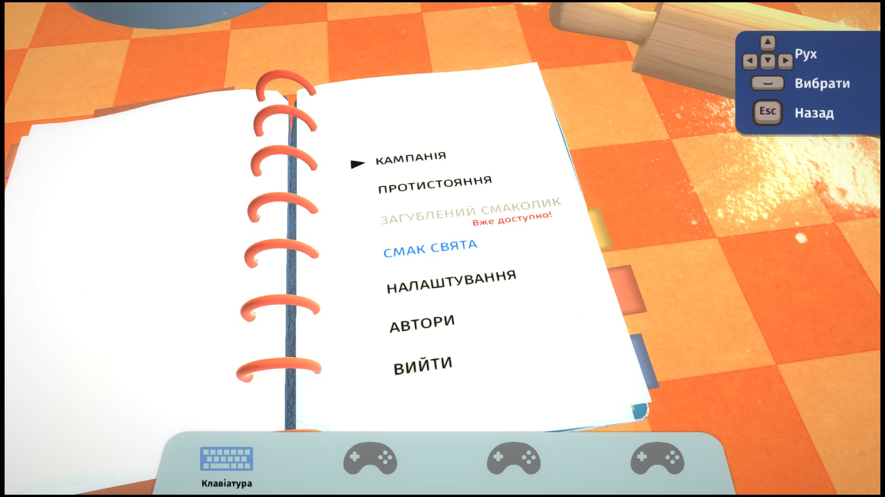
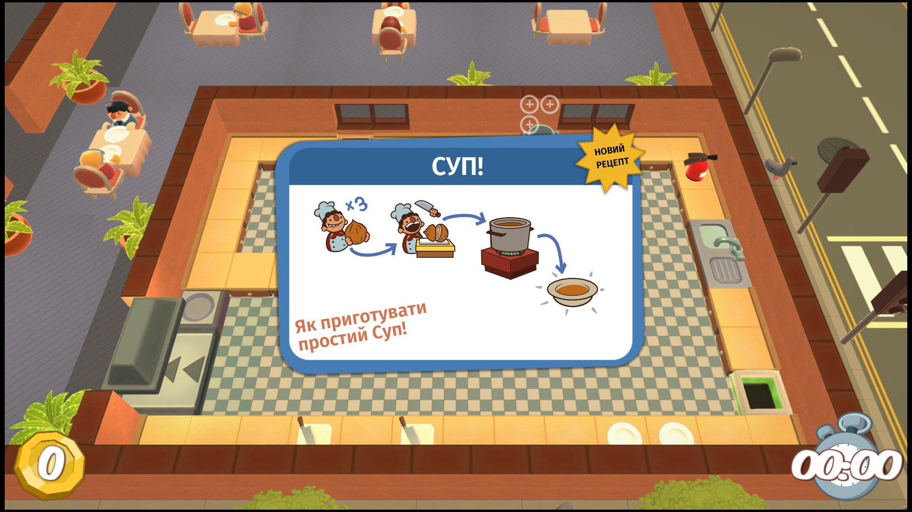
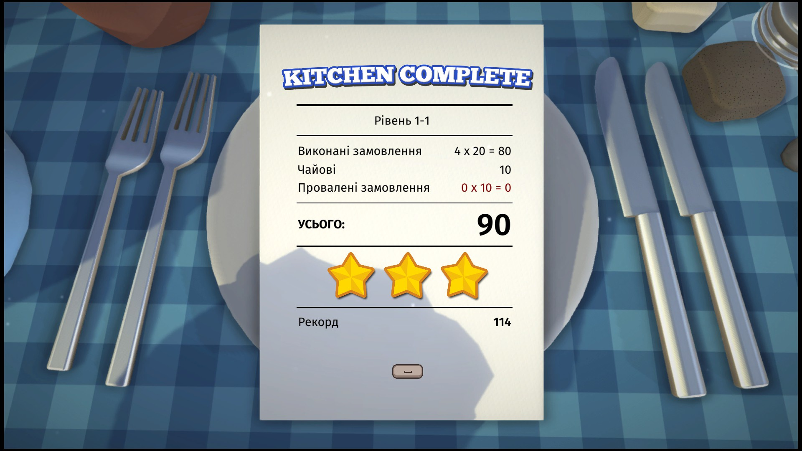
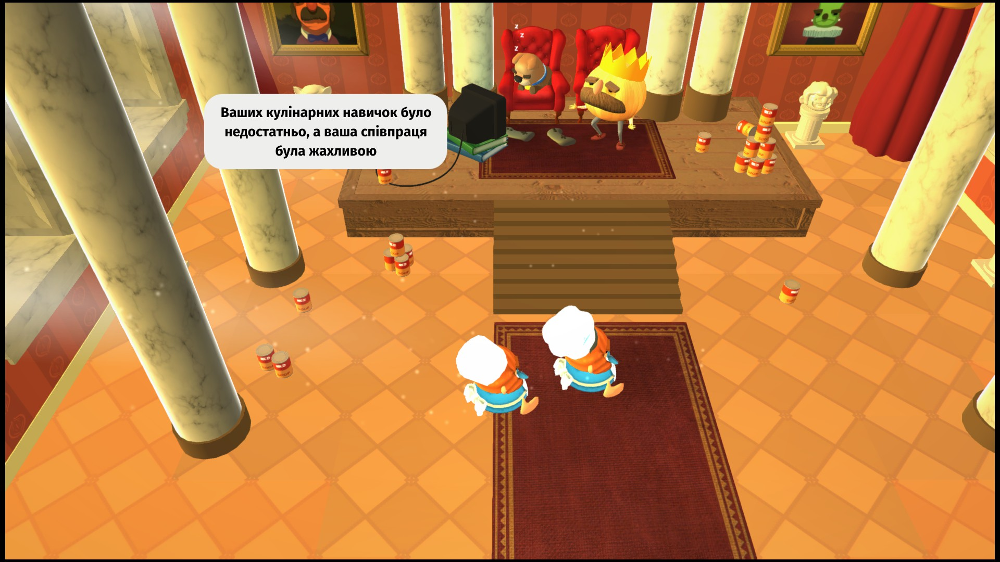
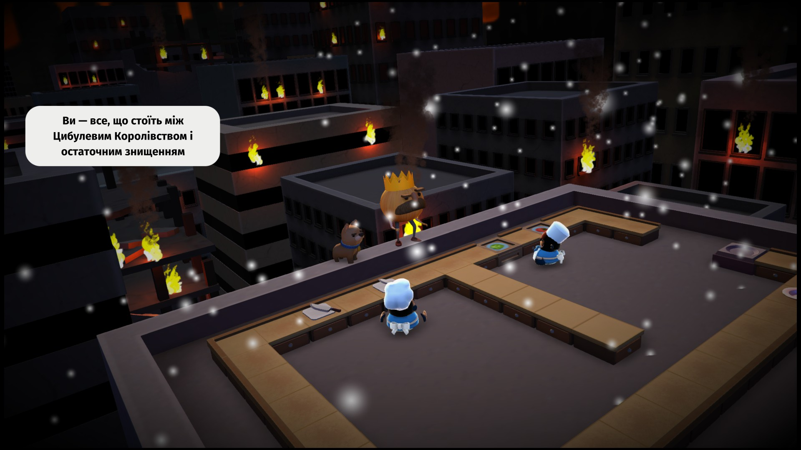

# Українізатор Overcooked
## 📑 Зміст

- [🔰 Вступ](#-вступ)
- [📜 Опис](#-опис)
- [🛠️ Інструкція зі встановлення](#️-інструкція-зі-встановлення)
  - [Встановлення локалізації](#для-встановлення-локалізації-гри)
  - [Повернути англійську мову](#щоб-повернути-англійську-локалізацію)
  - [Встановлення локалізації досягнень Steam](#для-встановлення-локалізації-досягнень-steam)
- [🔗 Посилання](#-посилання)
- [🐞 Відомі проблеми](#-відомі-проблеми)
- [😈 Авторство](#-авторство)
- [🗨️ Зворотний зв’язок та подяка](#️-зворотний-звязок-та-подяка)

---

## 🔰 Вступ

**Вітаю, відважні Кухарі та Кухарчуки!**

Гостріть свої ножі, готуйте каструлі, натирайте поверхні — наближається Великий та Жахливий Вічно Голодний Звір!  
Тепер ви можете відкласти свої словники та зосередитися на приготуванні їжі, адже **в Overcooked з’явилася українська мова**!

Більше не потрібно здогадуватись, чого саме від вас хочуть клієнти в розпал метушні на кухні. Кличте друзів та віддайтеся кухонному хаосові. Врятуйте Цибулеве Королівство, а разом з ним і всю планету, від велетенської космічної фрикадельки, що поглинає світи, вдосконаливши свою кухонну майстерність та взаємодію з друзями!

---

## 📜 Опис

Ця **українська локалізація Overcooked забезпечує повний текстовий переклад гри**: інтерфейсу, діалогів, рецептів, внутрішньоігрової статистики та навіть досягнень Steam. Переклад створено з урахуванням стилю гри, роблячи її зрозумілішою для українських гравців.

Оскільки в грі відсутня офіційна підтримка української мови, **ця локалізація замінює англійську**. Тобто, після встановлення весь текст, який раніше був англійською, відображатиметься українською.

**Локалізація працює зі Steam та Epic версіями гри**, однак може працювати й з іншими виданнями (потребує тестування).

👉 Локалізація виконана на основі файлів гри від **24 листопада 2017 року** (BuildID 2270609)

Переклад є фанатським і створений неофіційно, з дотриманням духу оригіналу, але **без участі розробників гри**.

**Приклади перекладу:**

  
  

  
  

---

## 🛠️ Інструкція зі встановлення

⚠️ Перед встановленням рекомендується **зробити резервну копію** оригінальних файлів гри, що замінюються.

### Для встановлення локалізації гри:

1. **Завантажте локалізацію** з [Google Drive](https://drive.google.com/drive/folders/1X14sN9zwuXqeK7RUTNFEOk7nqoY8Ry6Q?usp=sharing) або [GitHub](https://github.com/SatanistGodworshipper/Overcooked_Ukr_Localization)
2. **Замініть файл локалізації**:  
   У папці  
   `…\Steam\steamapps\common\Overcooked\Overcooked_Data`  
   замініть файл *`resources.assets`* на відповідний завантажений файл.
3. **Запустіть гру** та перевірте коректність відображення символів.

### Щоб **повернути англійську** локалізацію:

- Steam → Властивості Overcooked → Інстальовані файли → Перевірка цілісності файлів гри  
**або**
- замініть змінені файли на оригінальні з резервної копії.

### Для встановлення локалізації досягнень Steam:

1. **Помістіть файл** *`UserGameStatsSchema_448510.bin`*, отриманий з того самого архіву, **до папки**:  
   `...\Steam\appcache\stats`, замінивши наявний.
2. **Перезапустіть клієнт Steam**.  

Досягнення українською відображатимуться **лише якщо мова клієнта Steam — українська**.

---

## 🔗 Посилання

- 📘 **Steam-посібник:**  
  https://steamcommunity.com/sharedfiles/filedetails/?id=STEAM_GUIDE_ID

- 📦 **Завантаження локалізації з Google Drive:**  
  https://drive.google.com/drive/folders/1X14sN9zwuXqeK7RUTNFEOk7nqoY8Ry6Q?usp=sharing

---

## 🐞 Відомі проблеми

📁 Локалізація **тестувалася на Steam та Epic версіях гри**. Її сумісність з іншими версіями не перевірялася.

🏗️ Окремі написи в меню налаштувань **можуть виходити за межі відведених елементів інтерфейсу** через обмеження розмітки.

🥕 Підлеглі Короля Цибульки (а вони ще ті овочі) поки що не навчилися користуватися графічними редакторами, тож **тексти, які є частинами текстур, залишилися без змін**.

✍️ **Можливі окремі одруки чи неточності**. Якщо помітиш щось — **повідом про це**, і Король Цибулька спробує якнайшвидше відправити своїх підлеглих лагодити кухню.

---

## 😈 Авторство

- Переклад, технічні роботи та тестування: **Сатаніст Богопоклонник**
- Допомога в тестуванні: **Rozbiynyk**

---

## 🗨️ Зворотний зв’язок та подяка

Якщо ви знайшли помилку, маєте побажання чи хочете допомогти зробити переклад ще смачнішим — залишайте коментарі під посібником в Steam.

Король Цибулька, його підлеглі, а також Великий та Жахливий Вічно Голодний Звір разом із цією метушливою кухнею щиро вдячні вам, Шефе, за інтерес до української локалізації Overcooked. Якщо під час гри ви хоча б раз усміхнулися або кричали на друзів, рятуючи підгорілий суп — значить, локалізація ідеально пропеклася.

Не соромтеся ділитися Steam-посібником з іншими кухарями, су-шефами та майстрами кухонного хаосу. Нехай вони теж дізнаються, як це — горіти, панікувати та готувати українською.  
Хай жодна ваша страва не підгорить, а Звір не залишиться голодним! 🍲🔥
